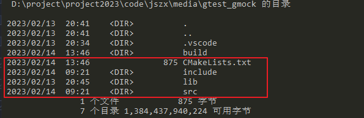

# 【2023-2-13】GoogleTest 教程

## 1. GoogleTest 介绍

GTest 是一个跨平台的 (Liunx、Mac OS X、Windows、Cygwin、Windows CE and Symbian) C++单元测试框架，由google公司发布。

GTest 有如下特点：

+ 提供强大的断言集，支持包括布尔、整型、浮点型、字符串等
+ 提供断言方法自定义扩展
+ 自动收集测试用例，无需开发者再次组织
+ 提供死亡测试功能
+ 可以将公共的用例初始化和清理工作放入测试夹具中，由gtest自动调用
+ 使用参数化自动生成多个相似的测试用例

### 1.1  gtest

单元测试框架通常会对一些变量或函数设置期望，若变量值或返回值符合预期，就认为单元测试用例通过。gtest也提供了下面一些断言：

`ASSERT_*` 系列的断言，当检查点失败时，立即退出单元测试； `EXPECT_*` 系列的断言，当检查点失败时，单元测试还是会继续执行，但结束后会标记所有`ECPECT_*`失败的用例； `EXPECT_CALL` 设置函数调用之后期望的实现，比如直接返回某一个值。该断言后面没有`.Times()`时，无论函数有没有调用都不会导致失败，如果有`.Times()`时，不满足`.Times()`设置的次数时就会导致期望失败；

### 1.2 

> 有时候对于一些接口，比如向服务器发送请求。但单元测试中有没有可用于测试的服务器，这个时候就需要mock这个请求接口。 **mock工具的作用是指定函数的行为（模拟函数的行为）。可以对入参进行校验，对出参进行设定，还可以指定函数的返回值。**

**Mock的基本使用方法是：**

1. `继承`某一个类；
2. `实现`或`重写`类中的某个或某些`虚方法`；
3. 创建Mock对象，设置重写方法的实现（大部分是直接返回，对于返回值是内置类型，即使不设置调用后的期望幸会，gmock也会设置默认返回值）；
4. 调用被测接口，Mock对象调用重写方法，期望满足，测试通过


## 2. Google Test 安装

```cmake
# 编译
cd D:\Program\googletest-1.13.0\googletest
# 创建文件夹
mkdir build && cd build 
# cmake 
cmake -DCAKE_CXX_STANDARD=17 ..

# 提示错误
Error: set_target_properties called with incorrect number of arguments.
# 添加
set(GOOGLETEST_VERSION 1.11.0)

# 重新编译 cmake && make
cmake -DCAKE_CXX_STANDARD=17 ..

make
```

## 3. Google Test 断言

+ `ASSERT_*` 系列的断言，当检查点失败时，立即退出单元测试；

+ `EXPECT_*` 系列的断言，当检查点失败时，单元测试还是会继续执行，但结束后会标记所有`ECPECT_*`失败的用例； `EXPECT_CALL` 设置函数调用之后期望的实现，比如直接返回某一个值。

+ 断言后面没有`.Times()`时，无论函数有没有调用都不会导致失败，如果有`.Times()`时，不满足`.Times()`设置的次数时就会导致期望失败；

### 3.1 基本断言

| Fatal assertion            | Nonfatal assertion         | Verifies             | 备注             |
| -------------------------- | -------------------------- | -------------------- | ---------------- |
| `ASSERT_TRUE(condition);`  | `EXPECT_TRUE(condition);`  | `condition` is true  | 判断状态是否为真 |
| `ASSERT_FALSE(condition);` | `EXPECT_FALSE(condition);` | `condition` is false |                  |

### 3.2 比较断言

| Fatal assertion          | Nonfatal assertion       | Verifies       | 备注     |
| ------------------------ | ------------------------ | -------------- | -------- |
| `ASSERT_EQ(val1, val2);` | `EXPECT_EQ(val1, val2);` | `val1 == val2` | 相等     |
| `ASSERT_NE(val1, val2);` | `EXPECT_NE(val1, val2);` | `val1 != val2` | 不等     |
| `ASSERT_LT(val1, val2);` | `EXPECT_LT(val1, val2);` | `val1 < val2`  | 小于     |
| `ASSERT_LE(val1, val2);` | `EXPECT_LE(val1, val2);` | `val1 <= val2` | 小于等于 |
| `ASSERT_GT(val1, val2);` | `EXPECT_GT(val1, val2);` | `val1 > val2`  | 大于     |
| `ASSERT_GE(val1, val2);` | `EXPECT_GE(val1, val2);` | `val1 >= val2` | 大于等于 |

> 用户自定义类型仅仅当定义了比较操作时，断言才能够比较的对象的大小，但是这不被Google的C++类型规范所提倡，这种情况下应当使用`ASSERT_TRUE()`或者`EXPECT_TRUE()`来进行判断。不过还是应当尽可能的使用`ASSERT_EQ(actual, expected)`，因为他能够在测试失败时告知`actual`和`expected`的值。


+ C风格字符串比较

`ASSERT_EQ()`在比较指针时比较的是指针的值，当比较两个C风格的字符串时，将会比较他们是否有相同的内存地址，而不是有相同的值。因此在比较C风格字符串的时候应当使用`ASSERT_STREQ()`，但是在比较两个string对象的时候，应当使用`ASSERT_EQ`。

+ 指针比较NULL 和nullptr

在进行指针的比较时应当使用`*_EQ(ptr, nullptr)`和`*_NE(ptr, nullptr)`代替`*_EQ(ptr, NULL)`和`*_NE(ptr, NULL)`，因为`nullptr`被定义了类型而`NULL`却没有。

### 3.3 字符串比较

### 字符串比较

这节的断言用来比较C语言风格的字符串，在比较两个string对象时，应该使用`EXPECT_EQ`,`EXPECT_NE`。

| Fatal assertion                | Nonfatal assertion             | Verifies                                                 |
| ------------------------------ | ------------------------------ | -------------------------------------------------------- |
| `ASSERT_STREQ(str1,str2);`     | `EXPECT_STREQ(str1,str2);`     | the two C strings have the same content                  |
| `ASSERT_STRNE(str1,str2);`     | `EXPECT_STRNE(str1,str2);`     | the two C strings have different contents                |
| `ASSERT_STRCASEEQ(str1,str2);` | `EXPECT_STRCASEEQ(str1,str2);` | the two C strings have the same content, ignoring case   |
| `ASSERT_STRCASENE(str1,str2);` | `EXPECT_STRCASENE(str1,str2);` | the two C strings have different contents, ignoring case |

**注意：`CASE`表明忽略大小写，一个`NULL`指针和空字符串不一样**

## 4. Google Test 

> 软件: vscode
>
> 测试单元：gtest
>
> 配置：cmake

+ 文件结构



+ 测试单元源码

1. [ gtest gitee](https://gitee.com/chccc1994/gtest)

2. [gtest github]()


## 参考

1. [Google Test](https://github.com/google/googletest)
2. 